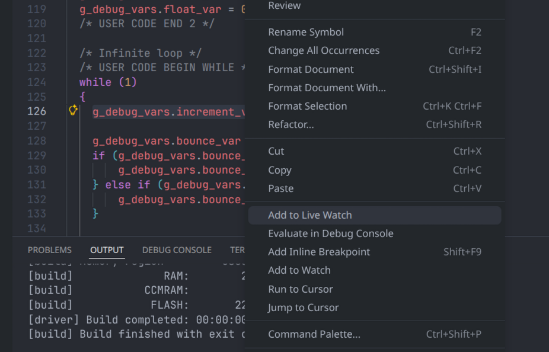
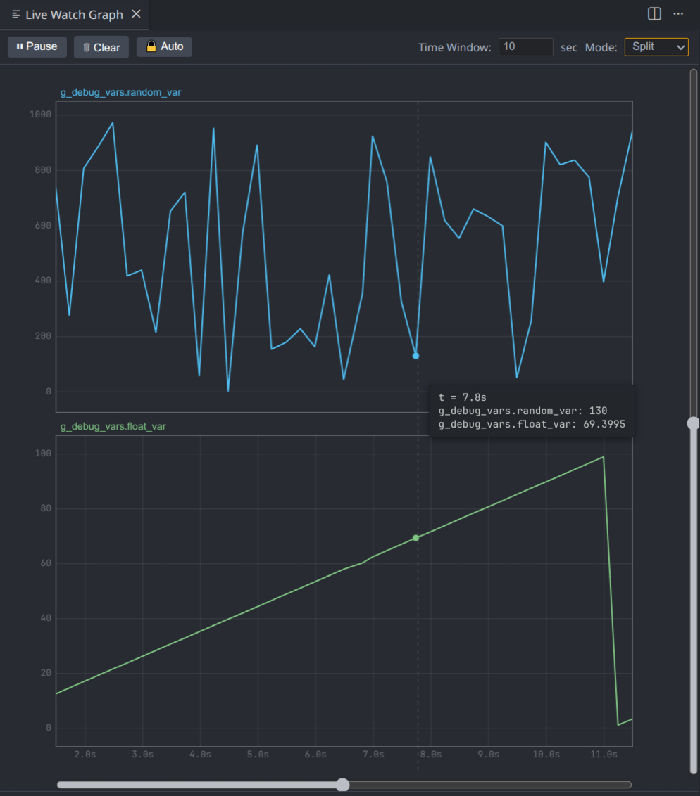
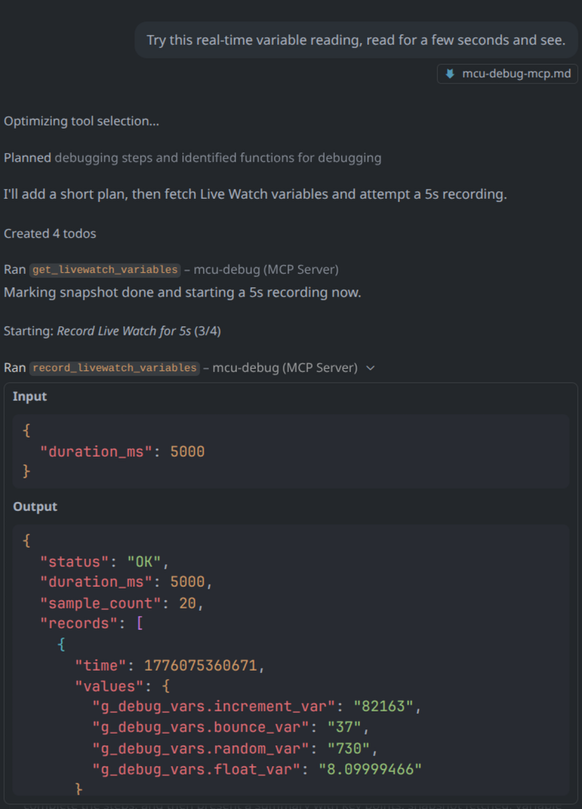

# MCU-Debug-AI: An Advanced UI and AI Integration Fork of MCU-Debug

This readme covers the major capabilities added to the `mcu-debug` VS Code extension, including editor integration for quick Live Watch additions, local recording to common file formats, a high-performance real-time graphing engine, and a Model Context Protocol (MCP) bridge for AI agent interoperability.

## 1. Editor integration & Local Recording

Make debugging workflows faster by adding expressions directly from the editor and recording Live Watch data to local files.

### Quick Add from Editor

- While debugging with MCU-Debug, select a C/C++ expression in the editor, right-click and choose "Add to Live Watch" to push the expression into the Live Watch panel instantly. The same action is available from the Command Palette via the `Add to Live Watch` command (command id: `mcu-debug.liveWatch.addSelectionToLiveWatch`).

### Local Recording (CSV / JSONL)

- The Live Watch supports recording selected leaf variables to a local file. Click the `Start Recording` / `Stop Recording` icon from the Live Watch view or run form the Command Palette — a Save dialog lets you choose `.csv` or `.jsonl` (newline-delimited JSON).
- CSV files include a header row `Timestamp` plus quoted variable names; JSONL produces one JSON object per line with a `timestamp` field and the variables as keys. The recorder sanitizes common GDB value formats (char literals, enum assignments) to numeric/string values and caches last-known values so each recorded row contains a value for every selected column.

### Quick usage

- Add expressions from the editor (right-click → "Add to Live Watch").
- Run `Start Recording` from the Live Watch view; select variables and a file path when prompted.
- Stop recording with `Stop Recording` (command or UI). The file will contain a timestamped timeseries in your chosen format.

---

## 2. High-Performance Canvas 2D Live Grapher

The Live Watch system includes a hardware-accelerated HTML5 Canvas rendering engine for real-time variable visualization.

### Features

- **Dual Display Modes**: Switch between "Split Mode" (one graph per variable with independent Y-axes) and "Overlay Mode" (all variables on a shared Y-axis).
- **Oscilloscope Auto-scroll**: By default, the graph behaves like a real-time oscilloscope, automatically scrolling to show the latest data. Users can break into manual "PAN MODE" for free-form navigation of historical data.
- **T and Y Sliders**: Dedicated slider controls on the right and bottom edges allow precise zooming of the Time and Y axes. Mouse wheel zooming is also supported and synchronized with the sliders.
- **Robust Rendering**: Strict Canvas `ctx.clip()` clipping prevents all label bleeding and border artifacts in both Split and Overlay modes.

---

## 3. Model Context Protocol (MCP) Server

The extension hosts an embedded MCP server that exposes debugger state to external AI agents (Copilot, Antigravity, Cursor, Claude Desktop, etc.) without requiring Python environments, GDB scripting, or memory dump parsing.

### Quick Start

1. Open the Command Palette (Ctrl+Shift+P) and run `MCU-Debug: Generate MCP Configuration for AI Agents`.
2. Choose a configuration format:
	- `VS Code Native MCP` — writes `.vscode/mcp.json` (VS Code-native MCP clients can auto-discover it) and `mcu-debug-mcp.md`.
	- `Generic MCP` — writes `.vscode/mcu-debug-mcp.json` and `mcu-debug-mcp.md`; copy the JSON into external AI agents' MCP settings (Antigravity, Cursor, Claude Desktop, etc.).
3. Start a new conversation or dialog and send `.vscode/mcu-debug-mcp.md` to agent to ensure it uses the built-in MCP tools.

### Architecture

- A TCP server listens on `127.0.0.1:51234` using VS Code's internal Node.js runtime (`ELECTRON_RUN_AS_NODE=1`).
- A bridge script (`support/mcp-bridge.js`) connects external MCP clients to this TCP server.
- The `mcu-debug: Generate MCP Configuration` command auto-generates ready-to-use JSON configs and a comprehensive API reference document (`mcu-debug-mcp.md`).

### MCP Tools

| Tool | Input | Description |
|---|---|---|
| `get_livewatch_variables` | None | Returns a JSON snapshot of all watched variables and their current values. Unexpanded structs are flagged with `<STRUCT_OR_ARRAY_UNEXPANDED>`. |
| `add_livewatch_variable` | `{ "expr": "..." }` | Adds a C/C++ expression to the Live Watch panel. |
| `expand_livewatch_struct` | `{ "expr": "..." }` | Expands an unexpanded struct/array to reveal its children. |
| `record_livewatch_variables` | `{ "duration_ms": N }` | Automatically records all leaf variables for a fixed duration and returns timeseries data. |
| `record_livewatch_variables_manual` | None | Records with user-controlled Start/Stop buttons in VS Code. Designed for hardware-synchronized data capture. |

### Struct Expansion Safety

When `get_livewatch_variables` encounters an unexpanded struct or array, it returns the sentinel value `<STRUCT_OR_ARRAY_UNEXPANDED>` instead of attempting a potentially dangerous bulk memory read. The AI agent must explicitly call `expand_livewatch_struct` to reveal the struct's children, then re-query `get_livewatch_variables` to read the expanded members.

### Recording Modes

**Automatic Mode** (default): The agent specifies `duration_ms` and a progress notification with a cancel button appears in VS Code. Duration is capped by `mcu-debug.mcpRecordingMaxDuration` (default: 30s).

**Manual Mode** (opt-in via settings): When `mcu-debug.mcpRequireManualRecording` is enabled, calling `record_livewatch_variables` returns a `MANUAL_MODE_REQUIRED` status, directing the agent to use `record_livewatch_variables_manual` instead. This tool presents two sequential VS Code prompts:
1. "Start Recording" / "Cancel" -- the user clicks Start when they are physically ready.
2. "Stop Recording" -- the user clicks Stop after completing their hardware operation.

This two-phase workflow allows engineers to precisely synchronize AI data capture with physical hardware operations (e.g., rotating a potentiometer, pressing a button, actuating a motor). Maximum wall-clock time is capped by `mcu-debug.mcpManualRecordingMaxDuration` (default: 60s).

### Generated Documentation

The `MCU-Debug: Generate MCP Configuration for AI Agents` command produces a [mcu-debug-mcp.md](./mcu-debug-mcp.md) file that serves as both a human setup guide and an AI system prompt. It contains:

- Exhaustive per-tool API reference with all possible `status` codes in table format.
- Behavioral rules that prevent agents from writing custom scrapers or parsing GDB output.
- Cross-referencing logic between automatic and manual recording tools.
- VS Code settings reference table.

---

## 4. VS Code Settings

| Setting | Type | Default | Description |
|---|---|---|---|
| `mcu-debug.mcpRequireManualRecording` | boolean | `false` | When enabled, automatic recording returns `MANUAL_MODE_REQUIRED` and agents must use the manual recording tool. |
| `mcu-debug.mcpRecordingMaxDuration` | number | `30` | Maximum recording duration in seconds for automatic mode. |
| `mcu-debug.mcpManualRecordingMaxDuration` | number | `60` | Maximum recording duration in seconds for manual mode. |

---

## 5. Key Files

| File | Purpose |
|---|---|
| `src/frontend/mcp-server.ts` | MCP tool definitions and request handlers |
| `src/frontend/extension.ts` | MCP config generation and doc generation |
| `src/frontend/views/live-watch.ts` | Live Watch tree provider, leaf variable gathering, MCP listener hooks |
| `src/frontend/views/live-watch-grapher.ts` | Graph panel lifecycle management |
| `src/frontend/views/live-watch-logger.ts` | Recording, sanitization and save logic |
| `resources/live-watch-graph.js` | Canvas 2D rendering engine |
| `resources/live-watch-graph.html` | Graph panel HTML layout with slider controls |
| `support/mcp-bridge.js` | External MCP client TCP bridge |

## 6. Licensing / Attribution

This repository is a fork of [`mcu-debug/mcu-debug`](https://github.com/mcu-debug/mcu-debug) with additional features (AI/MCP integration, Live Watch recording, and graphing).

### Upstream and component licenses

The upstream project uses a **multi-component license model**:

- **VS Code Extension (TypeScript / Debug Adapter layer)**: MIT License  
  See: `LICENSE-MIT` (and component-level license notes in `LICENSE`).

- **MCU-Debug Helper (Rust symbol/disassembly server)**: Apache License 2.0  
  See: `LICENSE-APACHE` (and `packages/mcu-debug-helper/LICENSE`).

Where individual source files include their own license headers, those headers apply. Otherwise, the component-level license applies as described above.

### Disclaimer / non-affiliation

This is an **unofficial fork** and is **not affiliated with or endorsed by** the upstream maintainers.