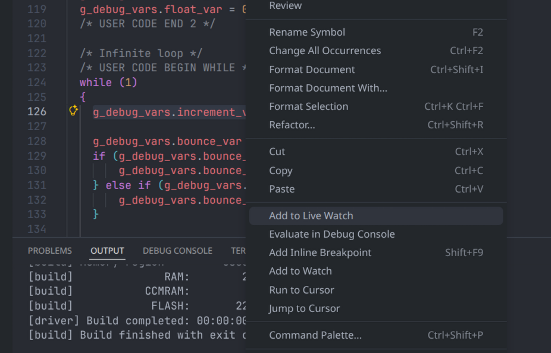

# MCU-AI-Debug: An Advanced UI and AI Integration Fork of MCU-Debug

MCU-AI-Debug extends the [MCU-Debug](https://github.com/mcu-debug/mcu-debug) VS Code debugger with CLI access to existing debug sessions, editor integration, GDB and JSON Live Watch, snapshots, local recording, and real-time graphs. AI agents can use the same GDB, RTT and UART streams as the IDE through the `mcu-ai-debug` CLI.


## Install the Agent Skill

Send the prompt:

>
> Find `mcu-ai-debug-fw` in the installed `Runzelee.mcu-ai-debug` VS Code extension under `support/skills/`, install it for your agent harness, and verify that it is discoverable.

---

## 1. Command-line debugger and AI Cockpit

Upstream provides the command-line debugger and AI Cockpit. This fork adds attachment to existing VS Code/F5 sessions, session selection across multiple VS Code windows, and a CLI Start/Stop interaction with the user. The public command is `mcu-ai-debug`; upstream GDB, RTT and UART command mapping is retained.

Run **Install CLI Tools** from the Command Palette to configure terminal access. The CLI requires Node.js 22 or newer; its wrappers are in `~/.mcu-debug/bin`. `mcu-debug` remains a compatibility alias.

### Shared and Independent Sessions

The fork's AI Cockpit **Mode** selector lets you choose between sharing the IDE debugger and the upstream-style independent debugger:

- **Follow VS Code Debug** (default): reuse the current window's F5 session and its existing GDB and RTT/UART streams. Start launches a VS Code debug session if needed.
- **Independent GDB Session**: launch a separate debugger using the selected configuration. Stop an active independent session before switching modes.

The CLI can select the same sessions, including those in other VS Code windows:

```sh
mcu-ai-debug sessions --json
mcu-ai-debug attach --session <session-id>
```

Use **Select Debug Session** in the Cockpit or `--session` in the CLI when several debuggers are running. Bare `attach` selects a session only when exactly one matches the current workspace. Connections stay bound to their selected session; disconnecting a shared client leaves F5 running. The CLI `exit` command terminates the selected debugger.

For independent CLI debugging, use `mcu-ai-debug debug -c "Your launch configuration"`. See the [bundled AI skill](packages/mcu-debug/support/skills/mcu-ai-debug-fw/SKILL.md) for the existing GDB/RTT/UART commands and Live GDB reads while the target is running.

### Manual Human Interaction

The fork's `manual` command opens a Start/Stop interaction in the VS Code window that owns the selected session:

```sh
mcu-ai-debug manual --session <session-id>
```

After the user approves **Start**, the agent uses normal CLI GDB/RTT/UART commands until the user chooses **Stop**. Stop ends the interaction without halting or terminating F5. Cancelling Start sends no debug commands.

UART output appears with `source: "serial"`; `status` lists the UART stream prefixes. During the approved interaction, send firmware input with its listed prefix, for example:

```text
!!send [UART] status
!!send [RTT#0] status
```

GDB commands still use ordinary stdin. Both shared F5 and independent CLI sessions retain the existing UART/RTT command routing.

For an agent already attached, `manual start`, `manual status` and `manual wait` accept the same `--session` option. The attachment receives the user's Stop notification, and `manual wait` waits for it. This CLI interaction is independent of legacy MCP and Live Watch; it requires a VS Code window to host the prompts.

---

## Model Context Protocol (MCP) Server (Deprecated)

`mcu-ai-debug.enableMcp` is **off by default** and marked Deprecated. With it off, the MCP server does not start and no workspace MCP files are generated. Use the CLI above for new AI-assisted debugging.

For existing MCP clients, enable the setting and run **MCU-AI-Debug: Generate MCP Configuration for AI Agents (Deprecated)**. This generates the client configuration and `.vscode/mcu-debug-mcp.md`. See the [legacy MCP reference](docs/mcu-debug-mcp.md) for tools and setup.

---

## 2. Editor integration, Snapshots & Local Recording

The **MCU AI Debug** sidebar contains **GDB Live Watch** above **JSON Live Watch**. Both views are available before debugging starts. Use GDB Live Watch to inspect expressions, or JSON Live Watch to display structured telemetry from the firmware.

### Quick Add from Editor

- Select a C/C++ expression in the editor, right-click and choose **Add to Live Watch**. The same action is available from the Command Palette.
- Use **+** in GDB Live Watch to enter an expression directly.
- Use the checklist action to enter batch-edit mode. Paste one expression per line, select expressions to add, or select existing top-level watches for removal.



Enable Live Watch in the debug configuration when supported by the target/server:

```json
"liveWatch": { "enabled": true, "samplesPerSecond": 20 }
```

For C++ namespace globals, use qualified expressions such as `app::pb8_debug`. See the [modm debugging guide](docs/modm.md) for SCons/lbuild configuration, debug ELF paths and RTT setup.

### Live Watch Snapshot (JSON)

**Save Snapshot** lets you select variables and export their current values to a JSON file.

- **GDB Live Watch** exports selected loaded leaf variables. Expand structs and arrays before selecting their members. Snapshots contain `timestamp`, `isoTime`, `variable_count` and a `variables` object keyed by expression.
- **JSON Live Watch** exports selected fields with their JSON types, session, transport and endpoint metadata, reception times and connection status. Members of collapsed objects and arrays can also be selected.

### Local Recording (CSV / JSONL)

Choose **Start Recording**, select variables and a `.csv` or `.jsonl` file, then use **Stop Recording** when finished.

- **GDB Live Watch** records selected loaded leaf variables. CSV contains a `Timestamp` column and variable columns; JSONL contains timestamped value objects. Common GDB representations, such as enum assignments and character literals, are normalized for export.
- **JSON Live Watch** records selected structured samples as they arrive, independently of the tree's display refresh. JSONL preserves typed values and source metadata; CSV uses fixed selected columns. Recording stops and flushes when a selected session or UART port disconnects.

### JSON Live Watch

Enable an RTT console channel (`rttConfig`) or a UART port (`serialConfig`) in the debug configuration and print one UTF-8 JSON object or array per line, ending with a newline:

```text
{"motor":{"rpm":4000,"enabled":true},"temperatures":[32.5,33.1]}
telemetry={"tick_ms":1234,"rpm":4000,"enabled":true,"error":null}
```

Both bare JSON and `name={...}` / `name=[...]` records are supported. Nested objects, arrays, numbers, booleans, strings and null appear as a read-only tree, grouped by session, transport, RTT channel or UART port, and record name. Identical names on different transports or ports remain separate. Each line replaces the previous snapshot with the same name; omitted fields disappear. Other records keep their latest values.

JSON Live Watch taps existing RTT and UART connections; it does not open another serial port or create another RTT poller. Plain console text and malformed records are ignored. Reception timestamps are host time; include a device tick or sequence field when needed.

Use **Add UART** (**+** in the MCU Debug panel) to pick a port and baud rate. The picker shows the device path, description, USB VID/PID and serial number, including the probe host for remote devices. With a debug session, the UART is shared with its CLI clients; with several sessions you choose its owner. Without debugging, it opens a standalone UART terminal that also feeds JSON Live Watch.

The MCU's `USART1`/`USART2` name does not identify a host device: connect that UART to your USB adapter or virtual COM port, then select the adapter. Linux commonly exposes `/dev/ttyUSB*` or `/dev/ttyACM*`; Windows exposes `COM*`, including `COM10` and higher. A manually entered path is interpreted on the selected probe host. Existing `serialConfig` selectors also support USB serial number or VID/PID; ambiguous selectors require a more specific match.

The terminal tab bar's **Clear Terminal** icon clears the active terminal and its replay history. UART reception, JSON values, recording and the debug session continue.

For UART, a typical launch configuration includes:

```json
"serialConfig": {
  "enabled": true,
  "ports": [{ "path": "/dev/ttyUSB0", "baud_rate": 115200, "label": "UART" }]
}
```

Use the actual device path (such as `COM3` on Windows) and the firmware's baud rate. CLI `attach` shares the IDE's UART connection; `debug -c` opens the ports from the selected configuration. UART bytes use the same JSON Lines format as RTT.

When the view is empty, **Click to copy firmware prompt** copies JSON-format instructions for generating telemetry over the project's existing RTT or UART setup. Use the view's **Save Snapshot**, recording and graph actions to capture or plot the received fields. Last values remain marked disconnected when the session or port ends. UART reconnection resumes updates with a fresh line buffer.

### CLI Access to GDB Live Watch

```text
!!livewatch read
!!livewatch add {"expression":"app::pb8_debug","userRequested":true}
!!livewatch remove {"expression":"app::pb8_debug","userRequested":true}
```

`read` returns the panel's already-loaded cached values without adding sampling. Add/remove requires an explicit user request and a panel belonging to the selected F5 session. Use GDB, RTT or UART for ordinary agent reads to leave the user's watch list unchanged.

### Quick usage

- Add GDB expressions from the editor or **+**, or print JSON Lines on an enabled RTT channel or UART port.
- Choose **Save Snapshot**, select the fields and save JSON.
- Choose **Start Recording**, select the fields and an output file.
- Use **Stop Recording** to finish, or **Open Real-Time Graph** to plot selected values.

---

## 3. High-Performance Canvas 2D Live Grapher

GDB Live Watch and JSON Live Watch provide real-time graphs for selected numeric values. Boolean JSON fields are plotted as 0/1. Each view has its own graph and recording selection.

### Features

- **Dual Display Modes**: use **Split** for one graph per variable with independent Y-axes, or **Overlay** to compare variables on a shared axis.
- **Oscilloscope Auto-scroll**: **Auto** follows incoming samples. Switch to **Pan** to browse history.
- **Pause / Resume**: freeze and resume the graph display while the debugger continues running. A separate recording continues independently.
- **Clear**: remove the displayed graph history.
- **T and Y Sliders**: adjust the time and value ranges; mouse-wheel zoom and panning are also supported.
- **Legends and Tooltips**: identify series and inspect values at a point in time.


---

## 4. Key Files

Paths below are relative to `packages/mcu-debug`.

| File | Purpose |
|---|---|
| `src/cli/ai-main.ts` | CLI session selection, attachment and manual interaction commands |
| `src/frontend/f5-session-bridge.ts` | Access to VS Code debug sessions and their existing streams |
| `src/frontend/manual-loop.ts` | Start/Stop interactions in the owning VS Code window |
| `src/frontend/views/live-watch.ts` | GDB Live Watch expressions, loaded values and cached panel access |
| `src/frontend/views/rtt-live-watch.ts` | Shared RTT/UART JSON variable tree, snapshots, recording and graphs |
| `src/common/rtt-watch.ts` | Structured RTT/UART JSON parsing and per-source snapshots |
| `src/common/rtt-watch-capture.ts` | Typed JSON/JSONL/CSV export for RTT and UART |
| `src/frontend/views/live-watch-grapher.ts` | Graph panel lifecycle |
| `src/frontend/views/live-watch-logger.ts` | GDB recording, value normalization and export |
| `resources/live-watch-graph.js` | Canvas graph rendering and interaction |
| `src/frontend/mcp-server.ts` | Deprecated MCP tool handlers |
| `support/mcp-bridge.js` | Deprecated external MCP client bridge |

### Build and Package

Repository development requires Node.js 24, npm, Rust and a native linker/toolchain. From the repository root:

```sh
npm ci
npm test
npm run package:local
```

`npm run package` is an alias of `package:local`. The output is `dist/mcu-ai-debug-<version>-<platform>-<arch>.vsix` for the current platform.

For a unified VSIX, prepare helpers for Darwin ARM64/x64, Linux ARM64/x64 and Windows x64, then run `npm run package:unified`. GitHub Actions **Package Extensions** builds those helpers and packages `dist/mcu-ai-debug-<version>.vsix`. A matching version tag creates a GitHub Release and automatically publishes its verified VSIX to Open VSX. Upload that release VSIX to the VS Code Marketplace manually; workflow dispatch only builds an artifact. See the [packaging and upstream porting reference](docs/upstream-porting-2026-10.md) for release configuration and validation.

---

## 5. Licensing / Attribution

### Relationship with Upstream

This fork builds on [`mcu-debug/mcu-debug`](https://github.com/mcu-debug/mcu-debug), including its debugger, server integrations, CLI and Rust runtime. Its additional CLI session integration, Watch views, editor actions, snapshots, local recording and graphing are described above. Upstream tracking and porting decisions are documented in the [porting reference](docs/upstream-porting-2026-10.md).

### Licenses

The project uses a **multi-component license model**. See [LICENSE](LICENSE), [LICENSE-MIT](LICENSE-MIT), [LICENSE-APACHE](LICENSE-APACHE) and the component licenses, including [packages/mdbg/LICENSE](packages/mdbg/LICENSE).

Where individual source files include their own license headers, those headers apply. Otherwise, follow the applicable component license.

### Disclaimer / non-affiliation

This is an **unofficial fork** and is **not affiliated with or endorsed by** the upstream maintainers.
