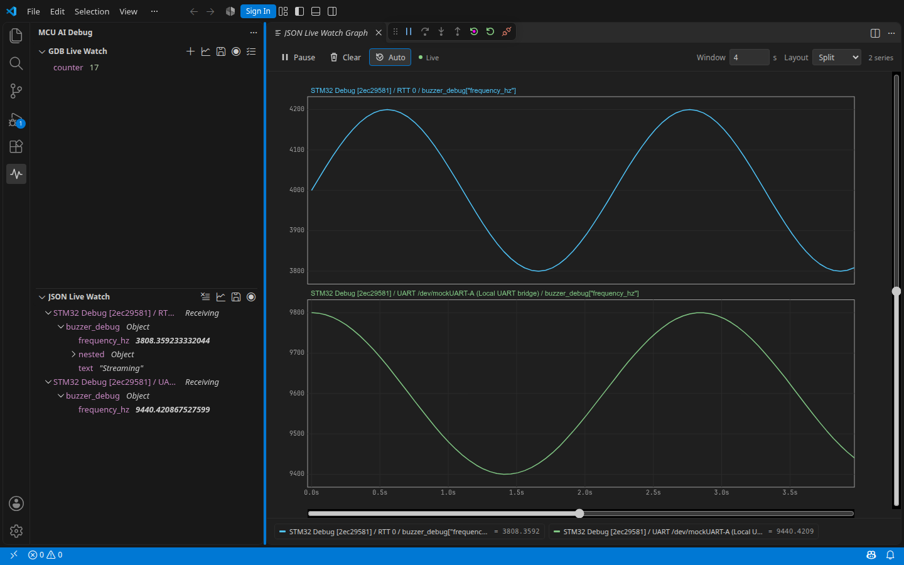

# MCU-AI-Debug

MCU-AI-Debug is an unofficial fork of [mcu-debug](https://github.com/mcu-debug/mcu-debug). It carries the upstream command-line debugger and AI Cockpit, plus this fork's Live Watch batch editing, snapshots, CSV/JSONL recording, and real-time graphs. The earlier Live Watch MCP bridge remains available as a **deprecated, opt-in** compatibility feature.

## Debug from the CLI

The upstream `mcu-debug` CLI uses your `mcu-debug` launch configuration to start the GDB server and debug adapter. It combines GDB, RTT, and UART output in one session. Ordinary GDB commands such as `break main`, `continue`, and `print counter` work in the CLI; session commands such as `status`, `!!SIGINT`, `!!NOTE`, and `!!send [RTT#0] text` are provided by mcu-debug. Another terminal or AI agent can join a running session with `mcu-debug attach`.

```sh
mcu-debug debug -c "Your launch configuration"
mcu-debug attach
```

For a plain stream suitable for an AI subprocess or a log, use `mcu-debug debug -c "Your launch configuration" --no-tui`. The VS Code AI Cockpit displays the shared session in a VS Code panel. See the [upstream CLI guide](https://mcu-debug.github.io/mcu-debug/docs/cli/) and the bundled [AI skill](./support/skills/mcu-debug-fw/SKILL.md) for commands and setup. The CLI requires Node.js 22 or newer and the bundled `mdbg` helper.

RTT data is emitted by firmware through its RTT buffers; the CLI labels its channels and can send text back with `!!send`. CLI mode does **not** currently expose Live Watch variable subscriptions. Use the VS Code Live Watch view for uninterrupted variable sampling and the local recording/graphing features below.

## Live Watch additions in this fork

- Select an expression in the editor and choose **Add to Live Watch**. The checklist button on the Live Watch view enables multiline batch addition and checked bulk removal.
- **Save Snapshot** selects leaf variables and exports their current values as JSON. Expanded struct members can be selected for capture.
- **Start Recording** selects variables and writes a timestamped CSV or JSONL file until **Stop Recording** is used.
- **Open Live Graph** plots watched numeric values in split or overlay mode, with time/Y zoom and historical panning.



These view features are independent of the CLI's RTT stream. They still require a supported live debugging session and hardware that permits running-target reads.

## Legacy MCP bridge (deprecated)

The old MCP server is **off by default**. It does not listen on a port or write a workspace MCP port file unless `mcu-ai-debug.enableMcp` is enabled in VS Code Settings. This setting is marked **Deprecated**. For existing MCP clients, enable it and then run **MCU-AI-Debug: Generate MCP Configuration for AI Agents**. Only that explicit command writes `.vscode/mcp.json` or `.vscode/mcu-debug-mcp.json` and `.vscode/mcu-debug-mcp.md`. No MCP instruction Markdown is generated during normal startup.

The legacy tools cover Live Watch snapshots, expression addition, struct expansion, and timed or manual recording. See the [legacy MCP reference](https://github.com/Runzelee/mcu-ai-debug/blob/main/docs/mcu-debug-mcp.md) if you still use them. Existing workspace MCP configuration files from older versions are not removed automatically; remove them yourself when switching clients to the CLI.

## Build and validation

Use Node.js 22 or newer. Run `npm install`, then `npm run compile`. Rust builds require the toolchains described in [mdbg build instructions](https://github.com/Runzelee/mcu-ai-debug/blob/main/packages/mdbg/BUILD.md). A device-level debug/RTT check is still needed before relying on a new build with real hardware.

## Relationship and licenses

This fork is not affiliated with or endorsed by the upstream maintainers. Upstream CLI, proxy, and debugger code remains under its component licenses; see [LICENSE](./LICENSE) and the [repository license files](https://github.com/Runzelee/mcu-ai-debug). Fork-specific additions retain their existing licenses and notices.
